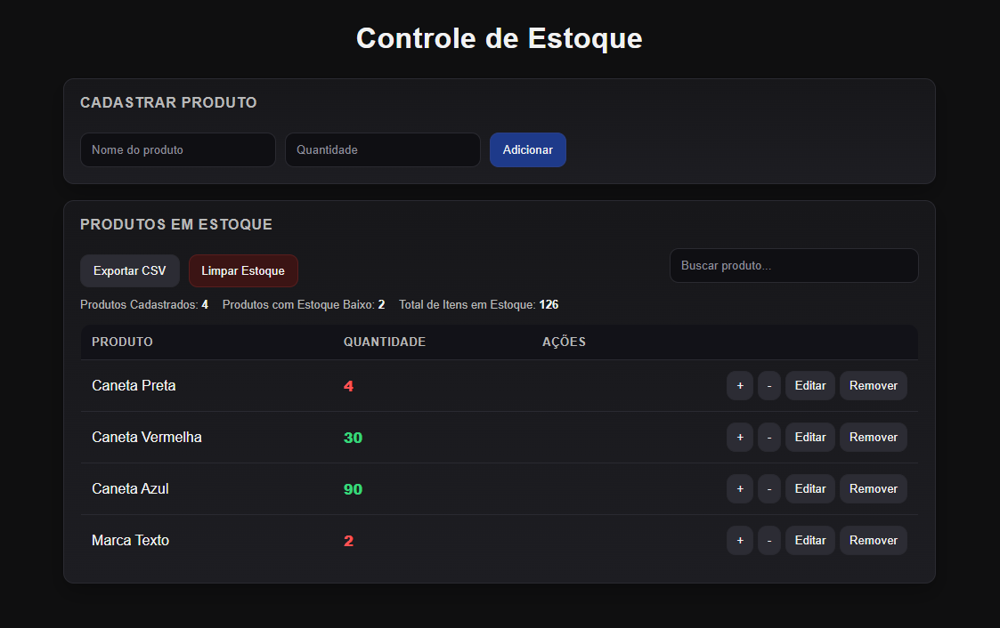

# Controle de Estoque

## 📸 Screenshot

Projeto simples de controle de estoque desenvolvido com HTML, CSS e JavaScript.

O objetivo é praticar lógica de programação, manipulação do DOM e armazenamento de dados no front-end.

